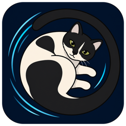
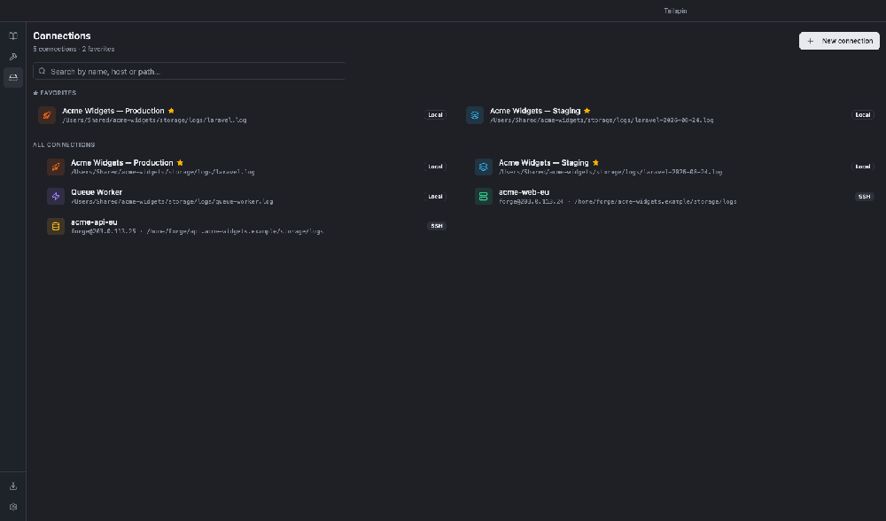
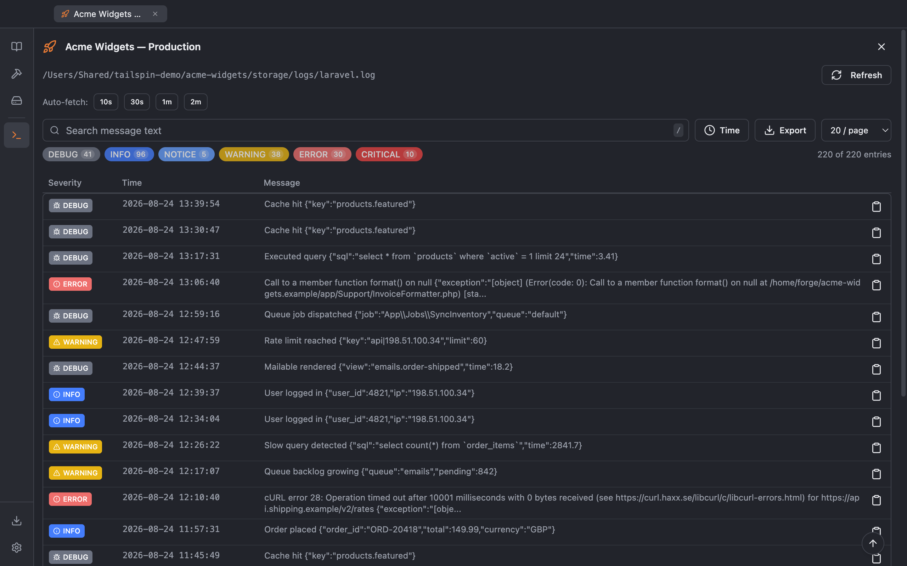
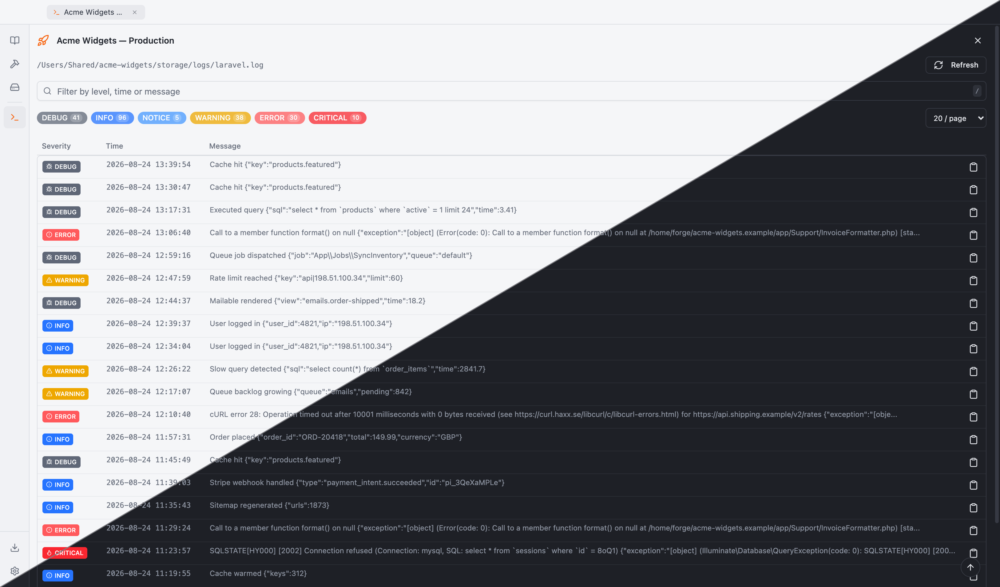
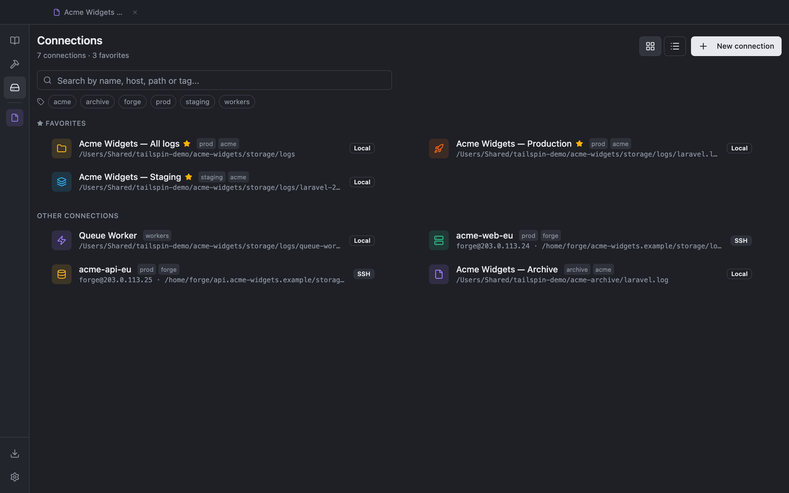
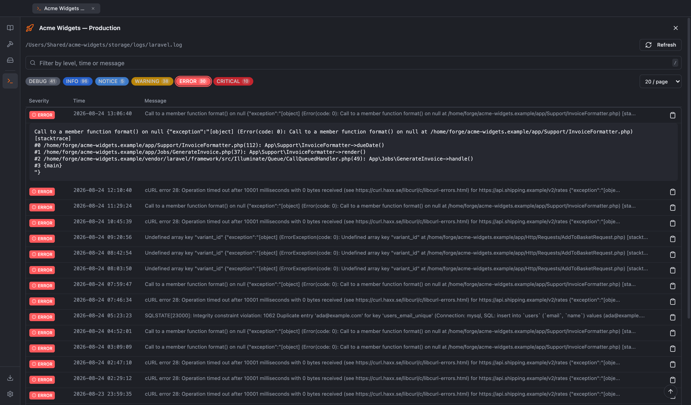
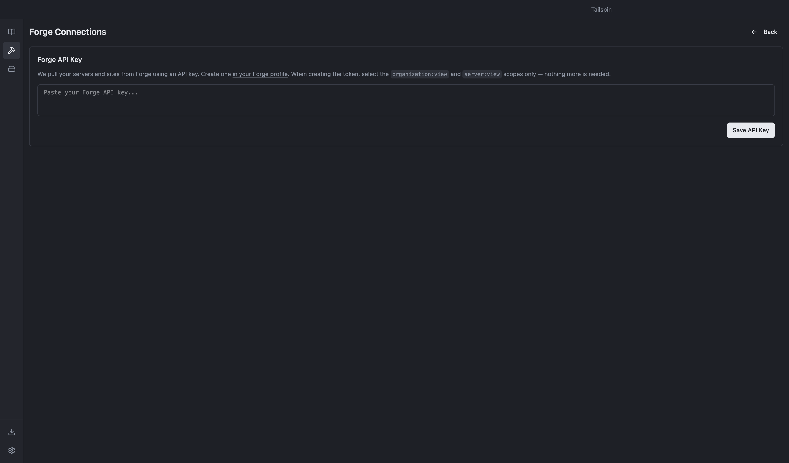
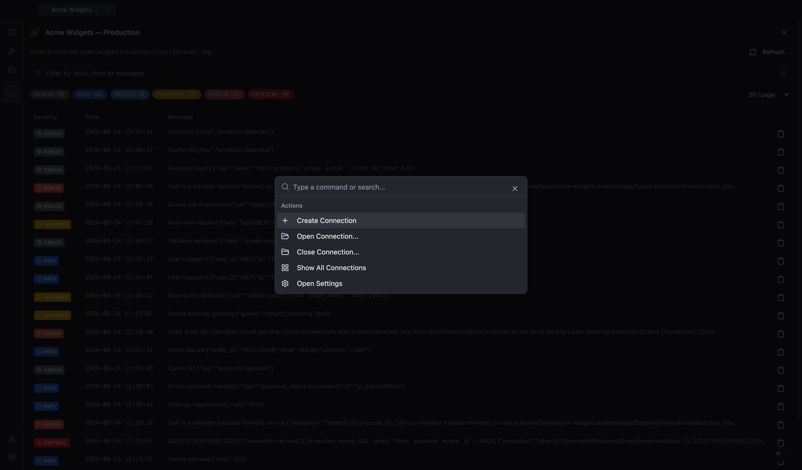
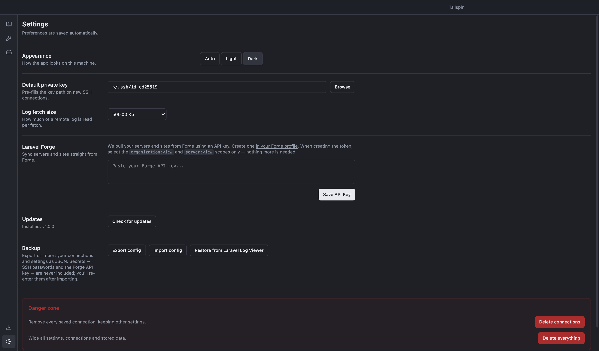

<p align="center">
  
</p>

<h1 align="center">Tailspin</h1>

<p align="center">
  <strong>Read production Laravel logs like they're on your own machine.</strong><br>
  Local files, servers over SSH, and every site on your Forge account, parsed into something you can search.
</p>

<p align="center">
  <a href="https://github.com/appoly/tailspin/releases/latest">Download</a>
  ·
  <a href="#features">Features</a>
  ·
  <a href="#development">Development</a>
</p>

<p align="center">
  
  
  
</p>

---

Something breaks in production. You `ssh` into the box, `cd storage/logs`, `tail -n 500 laravel.log`,
and then squint at a forty-line stack trace wrapping through your terminal, interleaved with the
twelve other exceptions thrown that minute. You find the one you want, lose it while scrolling, and
start again, then do the same for the queue worker and again on the other server.

Tailspin is that loop without the terminal. Point it at a log file or a server and every entry
becomes a row with its timestamp, environment and severity. Filter to just the errors, search the
text, expand one to read its full stack trace without losing your place, and leave auto-fetch
running while you reproduce the bug.

<p align="center">
  
</p>



The same screen in light and dark:



## Features

- **No SSH session needed.** Open a log file on disk, or connect over SSH (password or private key, passphrase supported) and browse a server's logs from the app. Connections are pooled, so refreshing and auto-fetching reuse one session instead of reconnecting.
- **Rotated and gzipped logs too.** `laravel.log.1`, `laravel-2026-08-24.log.gz` and friends show up alongside the live log. Compressed files are read from their tail on the server without ever pulling the whole thing down, and refuse politely if they would expand past a safe size.
- **A file browser, not a dropdown.** Directories list their logs by name, size and last modified, newest first, with a filter box, right-click to download or copy the path, and a collapsed one-line summary once you have picked a file.
- **Stack traces you can actually read.** Multi-line Laravel entries are parsed into rows with timestamp, environment and severity. Expand one and frames are laid out one per line with the file and line number emphasised, vendor frames dimmed and trailing JSON context pretty-printed.
- **Find the one that matters.** Filter by severity, search the text with matches highlighted, and narrow by time range with quick presets or an exact from/to. Timestamps with an offset can be shown in server or local time.
- **Watch it happen live.** Auto-fetch polls a remote or local log while you reproduce the bug, with new entries appearing at the top. A new error while you are on another tab gets an OS notification and a dot on the tab.
- **Keyboard-first.** ⌘K opens a palette that searches connections, open tabs and actions in one list. `⌘1`–`⌘9` switch tabs and middle-click closes them. `/` focuses search, `j`/`k` move between rows, `enter` expands, `c` copies.
- **Take it with you.** Export the filtered entries as text or JSON, download the remote file, or copy the `ssh` command and open the server in your terminal straight from the connection.
- **Your whole Forge account.** Add an API token and every server and site is two clicks from its logs. If a site rejects your key, the app tells you where in Forge to add it.
- **Several logs at once.** Saved connections with favourites, drag-to-reorder and custom icons, each open in its own tab.
- **Credentials stay in the keychain.** SSH passwords and the Forge token are encrypted with the OS keychain (Electron `safeStorage`) rather than written to disk in plain text.
- **Yours to keep.** One signed download per platform that updates itself. It needs no account and talks to nothing but GitHub.

<details>
<summary>More screenshots</summary>

|  |  |
|---|---|
| **Connections.** Favourites, drag-to-reorder, local and SSH side by side.<br> | **An expanded entry.** Filtered to errors, stack trace in full.<br> |
| **Laravel Forge.** Pull in servers and sites with an API token.<br> | **Command palette.** ⌘K to jump between connections and pages.<br> |
| **Settings.** Theme, default key, Forge token, config export and import.<br> | |

</details>

## Install

Grab the latest release from the [releases page](https://github.com/appoly/tailspin/releases/latest):

- **macOS:** `…_arm64.dmg` (Apple Silicon) or `…_x64.dmg` (Intel). Builds are signed and notarized, so they open without Gatekeeper warnings.
- **Windows:** `…​.exe` NSIS installer.
- **Linux:** `…​.AppImage`.

## Development

Requires Node 22+.

```bash
npm install
npm run dev        # vite dev server + electron with hot reload
npm run pre-build  # type-check (vue-tsc) + production build
npm run build      # pre-build + package installers with electron-builder
```

Stack: Electron, Vue 3 + Pinia, Tailwind CSS 4 with [reka-ui](https://reka-ui.com) components, `ssh2-promise` for remote log access. The renderer talks to the main process through a context-isolated preload bridge (`electron/preload/ipc-api`).

## Releasing

Releases are built by CI, never locally. **You push a tag; you never create the GitHub release
by hand.** The tag triggers the workflow, electron-builder opens a draft release and fills it
from all three platforms, and a final job publishes it.

### 1. Bump the version and commit it

```bash
npm version 1.1.0 --no-git-tag-version
git commit -am "chore: release v1.1.0"
git push
```

The version in `package.json` has to match the tag you are about to push. electron-builder names
its draft release after `package.json`, while the publishing job edits the release named after
the tag. If they disagree, the assets land on one release and the publish step fails on another.

### 2. Push the tag

```bash
git tag v1.1.0
git push origin v1.1.0
```

That push is the trigger (`on: push: tags: ['v*']`). Nothing else starts a release.

### 3. Wait for CI

```bash
gh run watch
```

Three jobs run in parallel; macOS is the slow one because notarization is a round trip to Apple,
so budget 15 to 25 minutes. A draft release shows up in the Releases tab within a few minutes and
gains assets as each platform finishes. Once all three succeed, the `publish` job generates
release notes from the commits since the last release, flips the draft public and marks it
latest.

### 4. Check the assets

Nine files. The three `.yml` manifests are the ones that matter: without them installed apps
have nothing to read, and update checks 404.

- `Tailspin_<version>_arm64.dmg`, `Tailspin_<version>_x64.dmg`
- `Tailspin_<version>_arm64.zip`, `Tailspin_<version>_x64.zip`. macOS updates from the zips; the
  dmg is only for people downloading by hand
- `Tailspin_<version>.exe`, `Tailspin-<version>.AppImage`
- `latest-mac.yml`, `latest.yml`, `latest-linux.yml`

### If a platform fails

`publish` only runs when all three builds succeed, so a failure leaves the release as a draft and
nothing is offered to users. Delete the draft and the tag before re-tagging, or electron-builder
appends to the half-filled draft:

```bash
gh release delete v1.1.0 --yes
git push --delete origin v1.1.0
git tag -d v1.1.0
```

### Signing secrets

`CSC_LINK`, `CSC_KEY_PASSWORD`, `CSC_NAME`, `APPLE_ID`, `APPLE_APP_SPECIFIC_PASSWORD`,
`APPLE_TEAM_ID`. See `electron-builder.env.example` for what each one is. `GITHUB_TOKEN` is
provided by Actions. Forks without a certificate still build: the macOS job drops to an unsigned,
unnotarized app rather than failing.

## Auto-updates

The app checks this repository's GitHub releases through `electron-updater`: a check runs a few
seconds after launch and on demand from Settings, downloads only happen when you ask, and a
downloaded update installs on quit. CI publishes the `latest-mac.yml` / `latest.yml` /
`latest-linux.yml` manifests alongside the installers, which is what the updater actually reads.

Because the repository is public, no token is needed for update checks. `publish.owner` and
`publish.repo` in `electron-builder.json5` must match the repository name. Installed builds keep
asking for the name they shipped with, so renaming the repository breaks updates for anyone
already running it.

Note that v1.0.0 cannot update itself: it shipped with update checks disabled and pointed at an
update service that was never deployed. Anyone on v1.0.0 has to install the next version by hand,
once; updates flow automatically from there.

To verify the round trip after changing anything in this area, install a release, cut a throwaway
patch version, then launch the older build. The update banner should appear within a few seconds
of startup.

## Demo data and screenshots

The screenshots above are generated, not hand-captured, so they never contain real hostnames:

```bash
node scripts/demo-data.mjs --out /Users/Shared   # fake Laravel logs + a demo config
node scripts/capture.mjs --seed --config /Users/Shared/tailspin-demo-config.json
TAILSPIN_CAPTURE=1 npm run dev                   # app with a DevTools endpoint
node scripts/capture.mjs                         # writes docs/media
```

`--seed` writes to the dev config only. Dev and the installed app keep separate `userData`
directories, so nothing you do in `npm run dev` can touch your real connections.
`scripts/capture.mjs --only <scene>` re-cuts a single shot; the storyboard is in
`scripts/scenes.mjs`.

## Licence

MIT. See [LICENSE](LICENSE) and [THIRD-PARTY-NOTICES.md](THIRD-PARTY-NOTICES.md). The software is
provided as-is, without warranty of any kind; Appoly does not offer support for it and accepts no
liability for its use.
